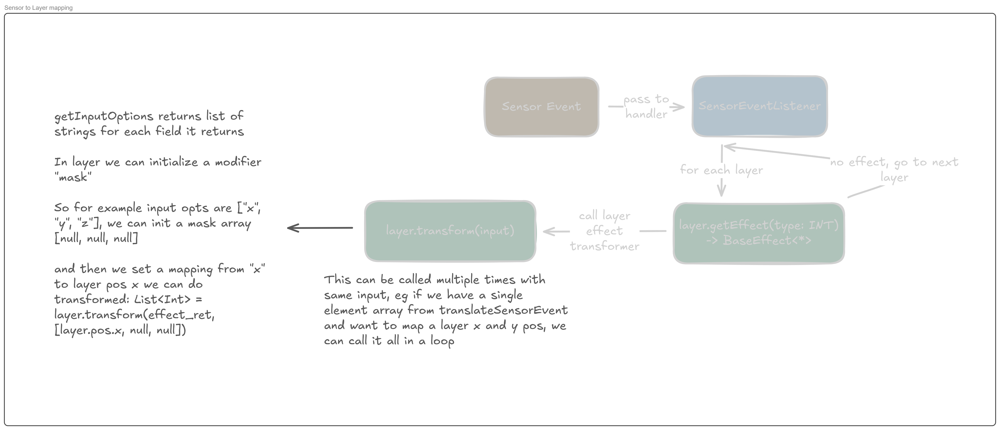

# DrawIt

# Table of contents
- [Installation](#installation)
  - [Dependencies](#dependencies)
  - [Instrucions](#instrucions)
- [Usage Guide](#usage-guide)
  - [Register/Login](#register/login)
  - [Creating a painting](#creating-a-painting)
    - [Drawing tools](#drawing-tools)
    - [Layers](#layers)
    - [Effects](#effects)
  - [Sharing](#sharing)
    - [Profile](#profile)
    - [Friends](#friends)
- [Project Structure](#project-structure)
- [Members](#members)
   
      
---
## Installation
- ### Dependencies
- ### Instrucions
## Usage guide 
- ### Register/Login
- ### Creating a painting
  - ### Drawing tools
  - ### Layers
  - ### Effects
- ### Sharing
  - ### Profile
  - ### Friends
## Project Structure
Todo
## Members
### Erki Toomemägi (toomemag)
### Anton Otrokov (Anton Otrokov)
### Mark Riispapp (markriis, 11x1)
### Romet Vislapuu (Romet-Vislapuu)

## Description
Community drawing app inspired by BeReal. Every day there is a random theme, where you have 10 minutes to draw based on the theme. Also an option to draw whatever you want.
Features are:
1.  Simple and effective drawing - paint, erase, fill, color picker and layers.
2.  Interactive effects - Bring your drawing to life with real time effects, manipulate layers with gyroscope.
3.  Daily Theme - Each day a new theme to work on.
4.  Community feed - See all sorts of drawings made by other artists.
5.  Friend feed - See what your friends have drawn.
  

## Figma Design  
[Figma Design Link](https://www.figma.com/design/5JaJyUQXZNMOg6Y6oCJqzi/Mobdev?node-id=1-2&t=MhjCKBsLWlb4n2oP-1)  
[Figma Prototype](https://www.figma.com/proto/5JaJyUQXZNMOg6Y6oCJqzi/Mobdev?page-id=1%3A2&node-id=4-322&p=f&viewport=1143%2C488%2C0.59&t=PAUF9tpjVYZ7eu66-1&scaling=scale-down&content-scaling=fixed&starting-point-node-id=4%3A2)  
[Readme About Designs](designs_v1/README.md)  
  
  
# General ideas and notes
## Sensor Output to Layer Transformations

