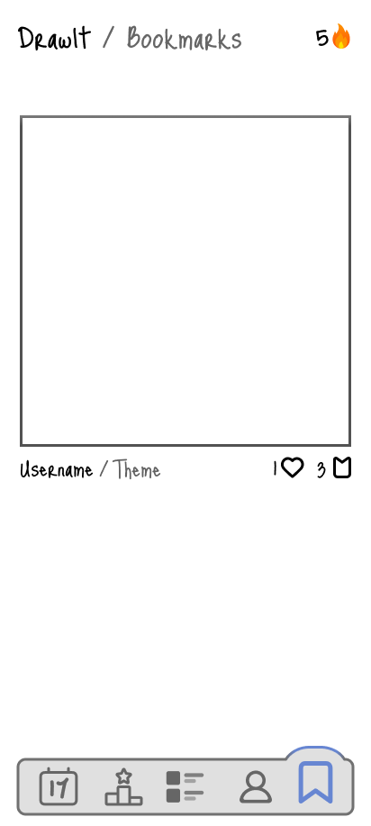

# Friend Feed
  
Scrollable list of today's friends' paintings. Navigation bar order:
- Friends' Paintings (Today)
- Leaderboard of yesterday's paintings
- Feed of global paintings
- Profile
  
# Friend Feed > New Painting
  
Option to paint either based on today's theme or a theme of your own.  
  
# Paint Mode
  
Back button to pause timer (time spent on drawing) and either continue or draft the current drawing. Guide rectangle for image bounds. Tool menu for available painting tools. Effects menu to make drawings interactive. Layer menu.     

# Paint Mode > Effects Selection
  
  
# Paint Mode > Effects Editor
  
  
# Paint Mode > Exit Popup

Popup to continue painting or save current painting as draft.  
  
# Profile Page  
  
  
# Friends Page
  

# Settings Page  
  
  
# Community Feed  
  

# Bookmarked
  
  
# Top Liked Yesterday
  
